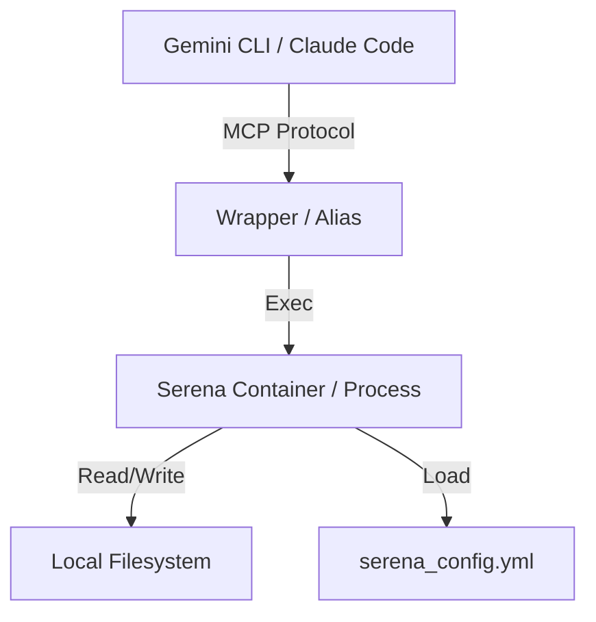

# Serena MCP Integration Design

## 1. Architecture Overview

The integration treats Serena MCP as a **Micro-Service for Edits**, stripping away its "Agent" persona. We will use a configuration-first approach to lock Serena into a "Headless Tool" mode.



## 2. Configuration Strategy

We will define a canonical `serena_config.yml` (or pass arguments via CLI) that enforces the constraints.

### Tool Selection
We will use the `--disable-tools` flag or `tools:` config section to whitelist:
- `find`
- `insert_before`
- `insert_after`
- `replace_content`

### Mode Selection
We will strictly enforce the combination of:
- `--mode no-onboarding`: Skips the "Hello, let me scan your project" phase.
- `--mode no-memories`: Disables the `.serena/memories` read/write cycle.

## 3. Implementation Details

### A. The Wrapper Script (`bin/serena-lite`)
A script to launch the server with the correct flags, abstracting the complexity.

```bash
#!/bin/bash
# Pseudocode for wrapper
serena start-mcp-server \
  --mode no-onboarding \
  --mode no-memories \
  --disable-tools rename_symbol,rename_file,debugger,lint,format,run_tests \
  --port 8000
```

### B. Docker Option (Preferred for Stability)
An alias or script that spins up the container.

```bash
docker run -d \
  -v $(pwd):/app/workdir \
  -v ~/.config/serena/config.yml:/app/config.yml \
  oraios/serena:latest \
  start-mcp-server --config /app/config.yml
```

## 4. Integration with comme-ca

- **Tool Definition:** We will add a `serena-lite` entry to the Gemini/Claude MCP configuration files (`~/.gemini/settings.json`, `~/.claude/config.json`).
- **Scaffolding:** The `prep` role will check for the presence of the `serena` executable or Docker image if this spec is active.

## 5. Verification Plan
1.  **Startup Test:** Launch server, verify no "Onboarding" prompt appears.
2.  **Edit Test:** Send a JSON MCP request to `find_symbol`, verify correct location returned.
3.  **Isolation Test:** Verify `.serena/memories` is NOT created.

```